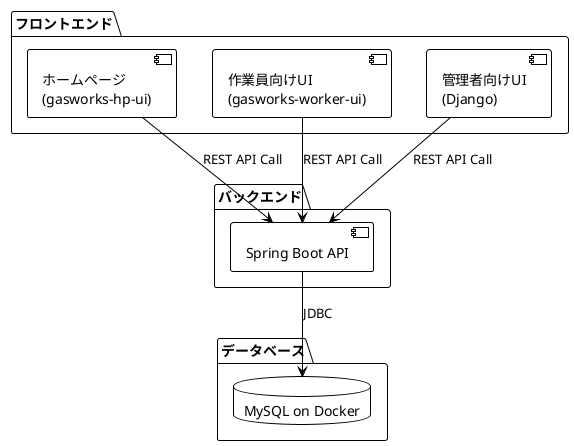

# 全体構成図

## 1. 概要

本システムは、ガス検針サービスの業務を支援するためのWebアプリケーションです。
作業員向けのフロントエンド、管理者向けの管理画面、そしてそれらを支えるAPIサーバーとデータベースで構成されます。

## 2. システム構成図

## 3. 技術スタック

| レイヤー | 技術 | 備考 |
|:---|:---|:---|
| ホームページ | Spring MVC (Thymeleaf) or React/Vue | gasworks-hp-uiとして開発。一般顧客向け |
| 作業員向けUI | React Native or Flutter or PWA | gasworks-worker-uiとして開発。現場作業用 |
| 管理者向けUI | Django | Python製の高速開発フレームワーク |
| APIサーバー | Spring Boot | Java製の堅牢なバックエンドフレームワーク |
| データベース | MySQL | Dockerコンテナ上で稼働 |
| インフラ | (未定) | 将来的にはAWS, GCPなどのクラウドを想定 |
